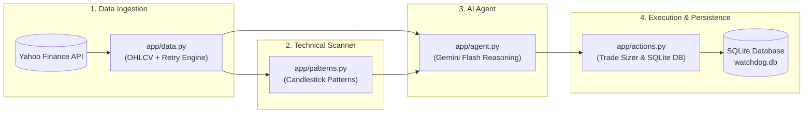

# 🐕 Portfolio Watchdog

> **Autonomous AI-Powered Stock Monitoring & Portfolio Management Agent**

[](https://www.python.org/downloads/)
[](https://fastapi.tiangolo.com)
[](https://aistudio.google.com/)
[](https://www.docker.com/)
[](https://opensource.org/licenses/MIT)

---

## 📖 Overview

**Portfolio Watchdog** is an autonomous trading agent designed to monitor a watchlist of high-volume equities (`AAPL`, `MSFT`, `GOOGL`, `TSLA`, `NVDA`), detect classic technical candlestick patterns, reason over market structure using **Google Gemini 2.5/3.5 Flash**, and execute simulated risk-managed portfolio rebalancing with persistent SQLite audit trails.

---

## 🏛 Architecture

Portfolio Watchdog follows a modular **4-Layer Pipeline Architecture**:

1. **Data Layer (`app/data.py`)**: Fetches daily OHLCV market feeds via Yahoo Finance with built-in 3-stage exponential backoff resilience.
2. **Pattern Recognition Layer (`app/patterns.py`)**: Rule-based technical scanner detecting Bullish Engulfing, Bearish Engulfing, Hammer, Doji, and Shooting Star formations.
3. **Reasoning Agent Layer (`app/agent.py`)**: Prompts Google Gemini with structured JSON schemas (`BUY`, `SELL`, `HOLD` with confidence scores and rationale).
4. **Action & Persistence Layer (`app/actions.py`)**: Sizing engine executing fractional/integer allocations on a simulated \$10,000 cash balance backed by SQLite.

### System Flowchart



---

## 🚀 Quick Start

### 1. Clone the repository
```bash
git clone https://github.com/your-username/portfolio-watchdog.git
cd portfolio-watchdog
```

### 2. Create and activate a virtual environment
```bash
# macOS / Linux
python -m venv venv
source venv/bin/activate

# Windows (PowerShell)
python -m venv venv
venv\Scripts\Activate.ps1
```

### 3. Install dependencies
```bash
pip install -r requirements.txt
```

### 4. Configure environment variables
```bash
cp .env.example .env
```
Edit `.env` and set your Google Gemini API key(s):
```env
# One or more keys, comma-separated. The agent uses one at a time and rotates
# to the next only when the current key returns 429 (quota exhausted).
GEMINI_API_KEYS=your_key_here
ALLOWED_ORIGINS=*

# Optional: run cycles automatically during US market hours (see below)
AUTO_RUN_ENABLED=false
AUTO_RUN_PER_DAY=8
```

> **Quota note:** each cycle costs one Gemini request per watchlist ticker.
> The free tier allows 20 requests/day **per Google Cloud project** - not per
> key - so extra keys only add capacity if they belong to different projects.

### 5. Launch the FastAPI server
```bash
uvicorn app.main:app --reload --host 0.0.0.0 --port 8000
```

### 6. Explore Interactive API Docs
Visit the interactive Swagger UI at:
👉 **[http://localhost:8000/docs](http://localhost:8000/docs)**

---

## 📡 API Endpoints

| Method | Path | Description |
| :--- | :--- | :--- |
| `GET` | `/` | Service health check, metadata, and link to docs |
| `GET` | `/watchlist` | Tracked tickers plus a live quote for each (price, previous close, % change) |
| `POST` | `/run-cycle` | Runs a complete autonomous monitoring and trade cycle across all tickers |
| `GET` | `/portfolio` | Cash balance, positions marked to live prices, and `total_position_value` |
| `GET` | `/history` | Logged AI decisions with the patterns and price snapshot behind each (optional `?ticker=AAPL`) |
| `POST` | `/reset` | Resets simulated portfolio to \$10,000 and wipes decision history |
| `GET` | `/scheduler` | Auto-run status: enabled, scheduled times, next run, last result |

---

## 🖥 Dashboard

The frontend is a single self-contained file, `frontend/index.html`. It reads
everything from the API - there is no hardcoded or placeholder data.

Serve it alongside the backend:

```bash
python -m http.server 5500 --directory frontend
```

Then open **http://localhost:5500** with the API running on port 8000.

| View | Shows |
| :--- | :--- |
| **TERMINAL** | Cash, total position value and equity; live ticker cards with % change; the agent decision log, streaming per-ticker output during a run |
| **DECISION LOG** | Every logged decision with reasoning, confidence and detected patterns, filterable by ticker |
| **Ticker card** | Click any card for that ticker's latest decision report and recent history |

---

## ⏱ Automatic Cycles

With `AUTO_RUN_ENABLED=true`, the backend runs cycles on its own, spread evenly
across the regular US trading session - **weekdays only**. Overnight and weekend
runs would spend quota re-reading the same unchanged daily bars.

With `AUTO_RUN_PER_DAY=8` the schedule is:

```
09:30  10:19  11:08  11:56  12:45  13:34  14:22  15:11   ET
```

Check status at any time:

```bash
curl http://localhost:8000/scheduler
```

Scheduled and manual runs share a lock, so the two can never overlap and
double-spend quota. Market holidays are **not** skipped.

> The scheduler is an in-process asyncio task, so it only runs while uvicorn is
> running. Stopping the server stops the schedule.

---

## 🐳 Docker & Cloud Deployment

### Build & Run Locally with Docker
```bash
# Build container image
docker build -t portfolio-watchdog .

# Run container exposing port 8080
docker run -p 8080:8080 --env-file .env portfolio-watchdog
```

### Deploy to Google Cloud Run
```bash
# Submit build to Google Cloud Artifact Registry
gcloud builds submit --tag gcr.io/YOUR_PROJECT_ID/portfolio-watchdog

# Deploy to Cloud Run
gcloud run deploy portfolio-watchdog \
  --image gcr.io/YOUR_PROJECT_ID/portfolio-watchdog \
  --platform managed \
  --region us-central1 \
  --allow-unauthenticated \
  --set-env-vars GEMINI_API_KEYS="key1,key2"
```

---

## ⚠️ Known Limitations

- **Cloud Run Ephemeral Storage**: When deployed on serverless container platforms (e.g., Google Cloud Run), local SQLite database files reset when instances scale to zero. For production persistence, transition SQLite to **Cloud SQL (PostgreSQL)** or **Firestore**. The `/reset` endpoint is available to initialize fresh states for live demos.
- **Yahoo Finance API Throttling**: Unauthenticated public endpoints from `yfinance` may occasionally encounter rate limits. Portfolio Watchdog mitigates this via an exponential backoff retry policy (1s, 2s, 4s).
- **Simulated Trading Environment**: All trade executions and position balances are virtual and paper-traded for demonstration purposes.

---

## 🛠 Tech Stack

| Component | Technology | Purpose |
| :--- | :--- | :--- |
| **API Framework** | [FastAPI](https://fastapi.tiangolo.com/) (Python 3.12) | High-performance asynchronous REST API backend |
| **Market Data** | [yfinance](https://github.com/ranaroussi/yfinance) | Daily OHLCV price and volume feeds |
| **LLM Reasoning** | [google-genai](https://pypi.org/project/google-genai/) | Gemini Flash structured decision-making |
| **Persistence** | [SQLite](https://www.sqlite.org/) | Embedded relational decision and portfolio ledger |
| **Server & Container** | [Uvicorn](https://www.uvicorn.org/) & [Docker](https://www.docker.com/) | Cloud Run–ready containerized runtime |
